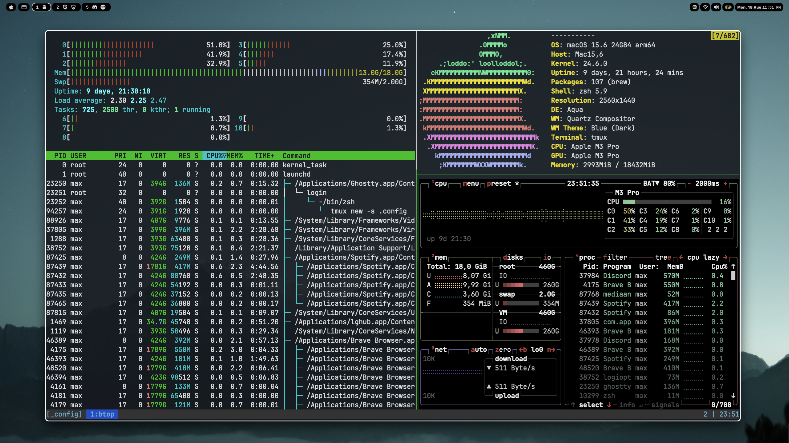

My macOS configuration files.

- SketchyBar
- JankyBorders
- Aerospace
- Tmux
- Misc

### Installation

1. `install.sh` will handle most installations
2. `setup.sh` symlink files to proper location if needed

